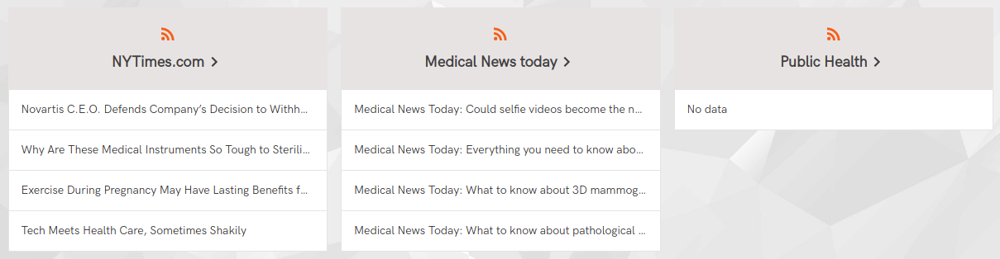
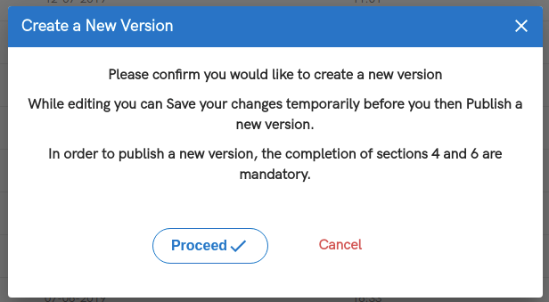

# General information
[PulseTile](http://docs.pulsetile.com/react-admin-background.html) - open-source UX / UI framework for healthcare - version based on React Admin , using a Lerna monorepository.

PulseTile-RA functionality includes:
- Core Framework -  Pages (Business Intelligence, Multipatient View, Single Patient View etc.);
- Plugins aka Tiles (Allergies, Medications, Problems, Vaccinations etc.);
- Tools (Advanced patients search, Patients search by Clinical Query, Contrast Mode, UserTour etc.). 

This repository also includes five different versions of PulseTile-RA project:
- [Showcase Stack](./projects/showcase/README.md);
- [Helm/ PHR](./projects/helm/README.md);
- [One London / IDCR ](./projects/london/README.md);
- [NodeRed-Showcase](./projects/nodered/README.md);
- [Scotland / Respect Care Plan](./projects/scotland/README.md).


Each project has unique set of plugins, pages and available tools. The main idea of this project is using general package [pulsetile-react-admin](./packages/pulsetile-react-admin) to create a lot of different application versions.

# Technologies 

This project is based on two main technologies: **React-Admin** and **Lerna**. 

[**React-Admin**](http://marmelab.com/react-admin/) is a framework based on ReactJS-library. It adapted especially for CMS development. More information about React-Admin you can find in [ReadMe-files](./projects/showcase/README.md) of the projects.

[**Lerna**](https://github.com/lerna/lerna) is a tool for multi-package projects managing. Besides this, it gives possibility to create a lot of versions of the project in one repository. 

# Installation

If you want to install PulseTile-RA locally, you should check that following modules are installed at your local machine globally:
``` 
$ npm -v           //  3.5.2 and more
$ node -v          //  8.10.0 and more
$ yarn -v          //  1.16.0 and more
$ git --version    //  2.17.1 and more
``` 
If any of these modules are absent at your local machine, you should install them.

Next clone the project from GitHub:
``` 
$ git clone https://github.com/PulseTile/PulseTile-RA-Lerna
```

Install all required modules:
``` 
$ cd PulseTile-RA-Lerna   // Project directory
$ yarn install
```

Bootstrap all your Lerna-packages:
``` 
$ lerna bootstrap
```

Create a build of `pulsetile-react-admin` package:
``` 
$ cd packages/pulsetile-react-admin
$ npm run build
```

After those steps your project will be ready for work. 

# Project structure

Structure of this project is described below:
```
|
|--- packages
|------- pulsetile-react-admin
|--- projects
|------- helm
|------- london
|------- nodered
|------- scotland
|----------- build
|----------- public
|----------- src 
|---------------- custom
|---------------- images
|---------------- App.js
|---------------- index.js
|----------- package.json
|----------- README.md
|------- showcase
|
```

There are two main directories: `packages/` and `projects/`.

The `packages/` directory includes `pulsetile-react-admin` package. It also includes all possible plugins, pages and tools of PulseTile-RA.

All versions in the `projects/` directory are based on `pulsetile-react-admin` package. 
Each version has `index.js` - it is a root file of project version. 

`custom/` and `images/` directories include [custom Layout](./projects/showcase/src/custom/Layout.js) with [Topbar](./projects/showcase/src/custom/Topbar/index.js), [Sidebar](./projects/showcase/src/custom/Sidebar/index.js) and [Footer](./projects/showcase/src/custom/Footer.js).

`App.js` is used to import `pulsetile-react-admin` package and set all required settings for the current version.  These settings are described below.

# Version parameters
 
Let's look inside `App.js` file of `nodered` version: 
``` 
// projects/nodered/src/App.js

import React, { Component } from 'react';
 
import { App, PatientSummaryPage } from "pulsetile-react-admin";
 
import * as themeConfiguration from "./custom/themeConfig";
import CustomLayout from "./custom/Layout";
 
class Core extends Component {
   render() {
     return (
         <App
             themeConfiguration={themeConfiguration}
             CustomLayout={CustomLayout}
             CustomHomepage={PatientSummaryPage}
             isAuthAbsent={true}
             isNodeRedVersion={true}
         />
     )
 
   }
}
 
 export default Core;
```

`App` is a root component of application. It is imported from `pulsetile-react-admin` package. This component has following properties:

**themeConfiguration** is an object that includes:

- **themeShortMenu** is an array of short menu (for the pages Charts, Patients List and Business Intelligence);
- **themeFullMenu** is an array of full menu (for all other pages);
- **themeCommonElements** is a list of settings that can be enabled or disabled (look at the list below);
- **themeImages** is a list of images that can be set in project (look at the list below);
- **pagesList** is a list of visible pages. List of all possible pages is presented [here](./packages/pulsetile-react-admin/src/routes.js);
- **pluginsList** is a list of visible plugins. List of all possible plugins is presented [here](./packages/pulsetile-react-admin/src/config/plugins.js);
- **pluginsOnlyForReview** is a list of plugins, where user can only review the list of items, but can't edit them or create new item.

**CustomLayout** parameter should define custom layout component. It is located in `custom/` directory.

**CustomHomepage** parameter should define component of Homepage. It has URL `http://{yourDomain}/#/`. User comes to login page after authorization. By default Homepage is [Charts](./packages/pulsetile-react-admin/src/pages/Charts/index.js) page.

**isAuthAbsent** (`false` by default). If it `true`, user will come to the homepage without authorization.

**isNodeRedVersion** (`false` by default). If it `true`, package will use [NodeRed data provider](./packages/pulsetile-react-admin/src/dataProviders/nodeRed/dataProvider.js) instead of [default](./packages/pulsetile-react-admin/src/dataProviders/dataProvider.js).

# List of `themeImages`

Let's look at `themeImages` object:

``` 
import BackgroundImage from "../images/background.jpg";
import logo from "../images/pulsetile-logo.png";
...
...
export const themeImages = {
    backgroundImage: BackgroundImage,
    logo: logo,
};
```

It can have two parameters: **backgroundImage** and **logo**. The first sets background image, and the second sets logo on it. For example, let's look at OneLondon version:


Images should be located inside `/projects/{projectName}/images` directory. 

# List of `themeCommonElements`

This object includes following properties:

- **isQwedVersion/isNodeRedVersion** - boolean that define type of data provider ([NodeRed](./packages/pulsetile-react-admin/src/dataProviders/nodeRed/dataProvider.js) or [QWED](./packages/pulsetile-react-admin/src/dataProviders/dataProvider.js));
- **menuHasChevrons** (`false` by default) - to set right chevrons near menu items:


- **isFooterAbsent** (`false` by default) - to hide Footer;

- **isTableHeaderIcon** (`false` by default) - to set icons on Patient Summary panels:


... and on Table Headers:


- **patientSummaryPermission** (`false` by default) - trigger Patient Access Disclaimer popup:

         

- **patientListColumnToggling** (`false` by default) - allow user hide or show columns at the patients list:
      
               

- **isPatientListCount** (`false` by default) - boolean that display additional columns at Patients list:

               

- **redirectToPlugin** (`false` by default) - allow to redirect user at the chosen plugin page;

       

- **feedsSelectors** and **feedsPanels** set the component that should be used for Feeds Selectors

            

... and Feeds panels on Patient Summary page:

      

These two settings are used only if current project version has Feeds.

- **homePage** set which component should be used as Home page (Charts page by default);

- **respectPanel** set the component that should be used for ReSPECT-plugin panel on the Patient Summary page.

  

These setting are used only if current project version has ReSPECT-plugin.

- **hasPatientSummaryRoll** (`false` by default). 

If `false` we see Patient Summary table:
 
  
 
If `true` we see roll view at the Patient Summary page:

  

# How can I create new project version?

If you want to create new project version, you should do the following:

- Create new directory inside `projects/`

``` 
$ cd projects
$ mkdir {myProjectName}
$ cd {myProjectName}
```

- Copy `public/` directory from any other project version (including all required fonts, icons, favicon and `index.html` file).

- Create `package.json` file inside `{myProjectName}` directory. You can copy `package.json` file from any other project version, but after this you should set `name` of your project:

``` 
// projects/{myProjectName}/package.json

{
  "name": {myProjectName},
  "version": "1.0.0",
  ...
}
``` 

- Create `index.js` file similar to any other version:

``` 
// projects/{myProjectName}/index.js

import React from 'react';
import ReactDOM from 'react-dom';
import App from './App';

ReactDOM.render(
  <App />,
  document.getElementById('root')
);
```

- Create `App.js` file without settings:

```
// projects/{myProjectName}/App.js

import React, { Component } from 'react';

import { App } from "pulsetile-react-admin";

class Core extends Component {
  render() {
    return (
        <App />
    )
  }
}

export default Core;
```

- Bootstrap new project as Lerna-package:

``` 
$ cd ../.. 
$ lerna bootstrap
```

- After new project was bootstrap, you should re-install all required dependencies:

``` 
$ yarn install
```

- After you install all dependencies, you can see that `node_modules/` was added to your new projects directory. So, you can try to run your application locally:

``` 
$ npm start
```

- You would see, that your application started successfully, but at that time you won't see plugins pages of application. To set them, you should add theme configuration settings. 

- Create `projects/{myProjectName}/custom/themeConfig.js` file and add some settings here:
``` 
import { Charts } from "pulsetile-react-admin";

export const themeShortMenu = [
    { id: 'menu-charts',   url: '/',         label: 'Charts' },
    { id: 'menu-patients', url: '/patients', label: 'Patients' },
];

export const themeFullMenu = [
    { id: 'menu-summary',       url: '/summary',       label: 'Patient Summary' },
    { id: 'menu-problems',      url: '/problems',      label: 'Problems / Issues' },
    { id: 'menu-medications',   url: '/medications',   label: 'Medications' },
    { id: 'menu-allergies',     url: '/allergies',     label: 'Allergies' },
    { id: 'menu-contacts',      url: '/contacts',      label: 'Contacts' },
];

export const themeCommonElements = {
    isQwedVersion: true,
    homePage: Charts,
};

export const themeImages = {};

export const pagesList = [
    'charts',
];

export const pluginsList = [
    'allergies',
    'contacts',
    'medications',
    'problems',
];

export const pluginsOnlyForReview = [];
```

... and import this file in `App.js`:

``` 
import React, { Component } from 'react';

import { App } from "pulsetile-react-admin";
import * as themeConfiguration from "./custom/themeConfig";

class Core extends Component {
  render() {
    return (
        <App
            themeConfiguration={themeConfiguration}
        />
    )
  }
}

export default Core;
```

If you update `npm start`, you would see, that pages Charts and Patients are visible. Plugins Allergies, Contacts, Problems and Medications are visible too.

- Customize your project according to examples in other versions. Default Topbar, Sidebar and Footer are similar to Showcase-version. 

# How to set theme colors

Color palette is set in `projects/{myProjectName}/public/index.html`. All settings are located inside `window.config` and available in each component of your application:
``` 
<script type="text/javascript">
  window.config = {
    domainName: "http://{yourDomainName}",
    isOldDesign: false,
    isRectangleButtons: false,
    lightPalette: {
      mainColor: "#ff5d00",
      secondaryMainColor: "#ff5d00",
      tableHeadColor: "#e9e4e4",
      dangerColor: "#da534f",
      disabledColor: "#e9e4e4",
      borderColor: "#e5e5e5",
      paperColor: "#fff",
      toolbarColor: "#e5e5e5",
      fontColor: "#3E3E3E",
      viewButton: "#ff5d00",
      topbarButton: "#757575",
      menuItemsColor: "#3E3E3E",
    },
    darkPalette: {
      mainColor: "#000",
      secondaryMainColor: "#000",
      tableHeadColor: "#e8e8e8",
      dangerColor: "#da534f",
      disabledColor: "#e9e4e4",
      borderColor: "#000",
      paperColor: "#fff",
      toolbarColor: "#fff",
      fontColor: "#000",
      viewButton: "#000",
      topbarButton: "#000",
      menuItemsColor: "#000",
    },
  }
</script>
```

First of all, you should set your **domain name**. It will be used for all requests to the server side.

Parameters **isOldDesign** and **isRectangleButtons** should be `false`.

You can see, that project has two palette of colors - **light** and **dark**. Light palette is used by default. Dark palette can be used if user switch on contrast mode by the clicking on the icon in the Topbar.

Which colors can we set here:

- **mainColor** and **secondaryMainColor** should be equal if **isOldDesign** is `false`, and different in opposite case. These parameters can set the main color of your project version;
- **tableHeadColor** set the color of table headers:


- **dangerColor** set the color of Cancel and Decline buttons:




- **disabledColor** set a color of disabled fields;


- **borderColor** set a color of block borders;

- **paperColor** is used for light background;

- **fontColor** set a color of the text at light background;

- **toolbarColor** set a color of tables and forms toolbars;

- **viewButton** set a color of View button which redirects user from Patients list to Patient Summary page:


- **topbarButton** set a color of right-corner buttons in topbar (Contrast mode and User panel buttons):


- **menuItemsColor** set a color of menu items:


If you want, you can add your custom settings to the palette. 

